Description
===========
- **Jeedouino v1.08**  [Changelog](changelog.md)
- **Aider le développeur : <https://www.paypal.me/jeedouino>**

   Ce plugin vous permet de contrôler de différentes manières les pins entrées/sorties des cartes suivantes :

   * Arduinos (différents modèles) branchés en USB sur *Raspberry PI*.
   * Arduinos (différents modèles) branchés avec un shield Ethernet (W5100, W5500, ENC28J60) sur votre réseau.
   * les ESP8266 (wifi) ex:  
     NodeMCU , Wemos, etc.  
     SONOFF 4CH & POW, ELECTRODRAGON 2CH.  
   * les GPIO du *Raspberry PI*.
   * les cartes PiFace (piRack) sur *Raspberry PI*.
   * les cartes IO PiPlus et les MCP23017 sur *Raspberry PI*.

   Il fonctionne en local (sur Jeedom) ou en déporté (seul : option JeedouinoExt) sur votre réseau.

   Il est compatible avec le fonctionnement du plugin Jeedom-Link de Jeedom.

Installation et mise à jour du plugin
====================================

> Une installation ou une mise à jour du plugin, sur un système un peu ancien, peut prendre du temps pour la mise à jour de celui-ci.  
> Il est fortement conseillé de mette à jour votre système linux auparavant.   
> Un reboot peut même être nécéssaire dans certains cas.  
> Il suffit de suivre les logs des dépendances pour surveiller la progression.   

Installation du plugin
---
   Après téléchargement du plugin sur votre Jeedom, il vous faut activer celui-ci.
   Si vous souhaitez uniquement utiliser des cartes Arduino avec shield réseau, il n'y a rien de plus a faire.

   Pour les Arduinos connectées en USB sur le R.PI, les cartes PiFace, PiPlus (MCP23017) et les GPIO du R.PI, il faudra aussi installer les dépendances concernées uniquement.

Mise à jour du plugin et des sketchs
---
- Les dépendances doivent être mises à jour pour l'utilisation des démons.
- Pour l’installation des dépendances, il faut que le système soit à jour, sinon elles ne peuvent pas s'installer correctement / complètement.
- Des dépendances ok sur des systèmes autre que RaspberryPI (ex: VM, PC, NUC, Freebox Delta) ne préjugent pas de leur bonne installation.

>
> De façon générale, il est préférable de relancer l'installation des dépendances - quelles soient ok ou non - lors de la mise à jour d'un plugin ou de la restauration d'un backup Jeedom.

- La mise à jour du plugin Jeedouino se fait via Jeedom.
- La mise à jour de l'option JeedouinoExt se fait via le plugin Jeedouino.
- Dans le cas de démons, il seront redémarrés automatiquement.

> Une mise à jour peut interférer momentanément sur le fonctionnement des équipement liés.

Il est conseillé suite à celle-ci, de faire un *Sauver / Générer* pour chaque équipement.  
Dans le cas d'Arduino/ESP/NodeMCU/Wemos, il peut être nécéssaire de les flasher avec le nouveau sketch généré (uniquement si vous souhaitez utiliser les derniers ajouts.).

Configuration du plugin
=======================

Sur la page configuration du plugin

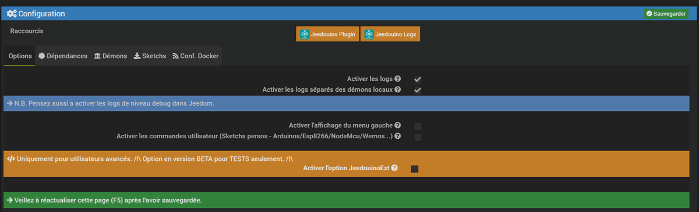

Onglet : Options
---
* Vous pouvez activer les logs (attention trés verbeux).

   > Il n'est pas recommandé de laisser cette case en permanence cochée car cette option génère beaucoup d'écriture dans les fichiers de log.  
   > Il faut aussi activer les logs de niveau "Debug" dans Jeedom ( Menu Configuration->Configuration des logs & messages ).  

* Vous pouvez activer la séparation des logs des démons de ceux du plugin pour plus de clarté.

* Il est possible d'activer les groupes virtuels (création automatique de commandes dans des virtuels pour simplifier vos équipements/installations).

   > Cette option n'apparaît que si vous avez le plugin Virtuel d'installé et d'activé dans votre Jeedom.

* Il est possible d'activer les pins utilisateur (création automatique de commandes pour vos sketchs perso Arduinos/ESPs).

Onglet : Dépendances
---

Un lien est disponible pour aller télécharger le dernier Arduino IDE pour flasher les sketchs sur vos cartes idoines.   
Seul celui de www.arduino.cc est considéré comme compatible.

* <https://www.arduino.cc/en/Main/Software>

   > Pour les cartes ESP8266, NodeMCU, Wemos vous pouvez aussi utiliser l'IDE Arduino en y ajoutant le support ESP8266.
   > <http://esp8266.github.io/Arduino/versions/2.0.0-rc2/doc/installing.html>

Pour les GPIO du R.PI, un bouton est disponible pour l'installation des dépendances.

* <http://sourceforge.net/p/raspberry-gpio-python/wiki/install/>

De même, un bouton est présent pour celles des cartes PiFace.

* <https://github.com/piface/pifacedigitalio>

* Il faudra aussi activer le module SPI.

* <http://www.piface.org.uk/guides/Install_PiFace_Software/Enabling_SPI/>

> Les paquets pifacecommon et pifacedigitalio pour la carte PiFace ne sont pas dispo sur le dépôt stretch.  
> Il faut donc installer les packages via pip  

Idem, un bouton est présent pour celles des cartes AB Electronics UK IO Pi Plus.

* <https://github.com/abelectronicsuk/ABElectronics_Python_Libraries/tree/master/IOPi>

* Il faudra aussi activer le module I2C.

* <https://www.abelectronics.co.uk/kb/article/1/i2c--smbus-and-raspbian-wheezy>

>Il n'est pas nécéssaire d'installer les dépendances sur tous vos Jeedom, uniquement sur ceux qui seront utilisés.

>Deux raccourcis sont présents pour aller directement voir les logs du plugin, et pour aller à vos équipements.

Onglet : Démons
---

_Exemple de différents démons possibles:_

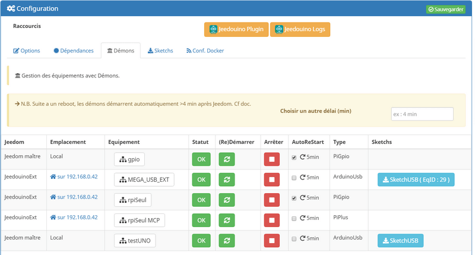

Ils apparaîtront dès que vous aurez créé des équipements nécéssitant l'utilisation de démons.

Ils seront affichés avec un raccourci direct vers l'équipement, leur Jeedom hôte, l'état de fonctionnement et la possibilité de redémarrer ou arréter le démon.
Une option AutoRestart permet de checker toutes les 5 minutes et redémarrer si besoin le démon.

>Concernant les équipements Arduino connectés en USB, un lien supplémentaire permettant de télécharger le sketch sera présent.
>Il faudra donc le téléverser dans l'arduino correspondant.

>Suite a un reboot/redémarrage du système hôte, les démons ne sont lancés que **4 minutes** environ après le démarrage de Jeedom.
>Il est possible de modifier ce délai à vos risques avec l'option situé au dessus.

Onglet : Sketchs pour vos équipements Arduino et ESP8266 (ex: NodeMCU / Wemos / Sonoff / Electrodragon)
---
Les Arduinos et Esp8266 en réseau wifi n'ayant pas besoin de démon, vous trouverez ici les sketchs pour ceux-ci.  
Uniquement ceux des équipements créés.

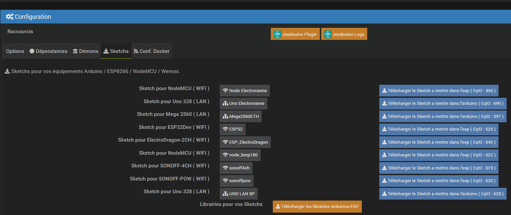

Onglet : Configuration Docker
---
Si votre Jeedom est sous Docker, il faut activer l'option, et renseigner l'IP de l'hôte (Celle du NAS le plus souvent) et le port mappé (souvent 9080).

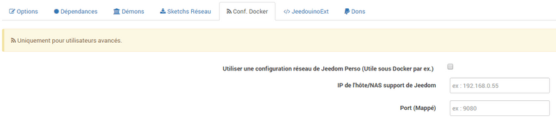

Création des équipements
========================

La configuration des équipements Jeedouino est accessible à partir du menu Plugins :

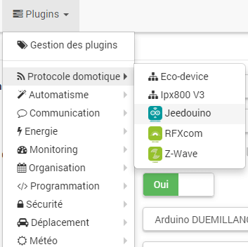

Voilà à quoi ressemble la page du plugin Jeedouino (ici avec déjà des équipements) :

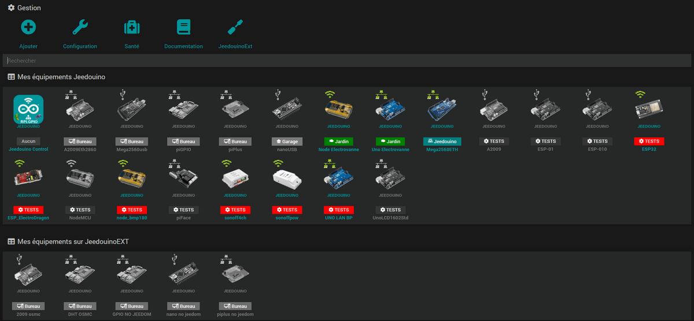

Une fois que vous cliquez sur le bouton + (Ajouter un nouvel équipement), et après avoir donné un nom à votre équipement, vous obtenez :

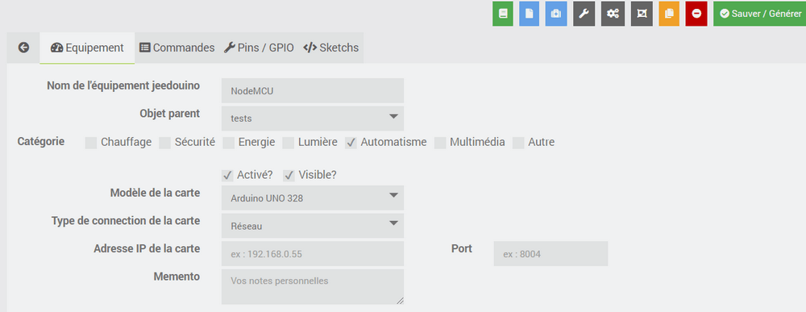

Vous retrouvez ici toute la configuration de votre équipement :

* **Nom de l'équipement** : nom de votre équipement Jeedouino,
* **Objet parent** : indique l'objet parent auquel appartient l'équipement,
* **Activer** : permet de rendre votre équipement actif,
* **Visible** : rend votre équipement visible sur le dashboard.

En-dessous vous retrouvez le paramétrage de votre équipement :

* **Modèle** : le Modèle de la carte que vous souhaitez controler,

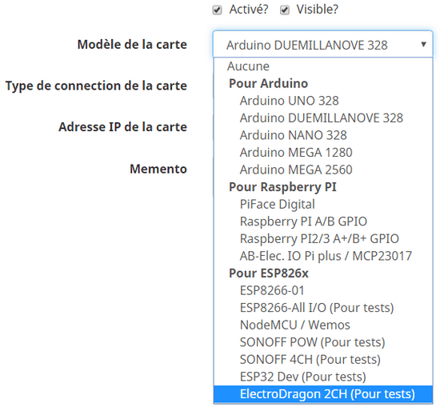

_Pour la carte PiFace, un numéro (de 0 à 3) est demandé pour l'identifier si vous en avez plusieurs (Si vous avez un piRack par ex.), sinon mettez 0_

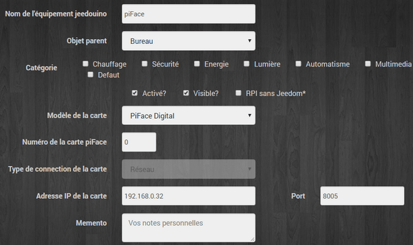

* **Type de connection** : port de connection USB ou Réseau,
* **Adresse IP et Port** : pour la connection à la carte via le réseau,

   >Même pour un équipement local, il faut renseigner l'adresse IP locale du Rpi/Jeedom.
   >Il faut aussi verifier que cette IP est correctement renseignée dans la configuration réseau de Jeedom.
   >

   > Les démons (GPIO et Piface par ex.) pouvant êtres sur le même Jeedom, il faut veiller à utiliser des ports différents pour chacun. Normalement, à la création d'un équipement, un port de libre vous est proposé.  
   > _Si nécéssaire, le démon choisira un autre port en lieu et place de celui indiqué s'il s'avère impossible de l'utiliser._  
   > Le port doit aussi être différent de celui du Jeedom hôte.

   > _Suivant les navigateurs, une flèche apparaît permettant de choisir directement une IP parmis vos Jeedom._   

* **Port USB** : Local ou déporté (JeedouinoExt), pour la connection du Jeedom à la carte via son port USB,
* **Port local/Port déporté** : Port USB physique où est connectée la carte,
   > * Si vous débranchez/rebranchez la carte du port USB du RPI, il vous faudra redémarrer le démon correspondant car le port peut avoir changé.

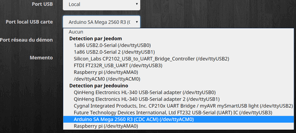
* **Port Démon** : pour la connection au démon via le réseau, l'IP du démon étant celle du Jeedom hôte.

   > Les démons ( Arduino USB par ex.) pouvant êtres sur le même Jeedom, il faut veiller à utiliser des ports différents pour chacun. Normalement, à la création d'un équipement, un port de libre vous est proposé.  
   > _Si nécéssaire, le démon choisira un autre port en lieu et place de celui indiqué s'il s'avère impossible de l'utiliser._  
   > Le port doit aussi être différent de celui du Jeedom hôte.

* **Sketch** : Dans le cas d'une carte Arduino ou ESP8266, le sketch pour celle-ci est proposé au téléchargement aprés une première sauvegarde de l'équipement.
(NB. Rafraîchissement de la page, il peut être nécéssaire de faire un F5 pour voir apparaître le lien )

   > Pour les modèles Ethernet (Arduinos), il est spécifiquement généré, en tenant compte de l'adresse IP choisie, du port choisi, et d'une adresse mac unique.   
   > _Ainsi que de l'IP, du complément '/jeedom' (ou non) et du port du Jeedom ( d'après votre configuration réseau dans Jeedom)._

   > _Le Sketch est par défaut prévu pour les shields avec chip W5100, mais il peut fonctionner aussi avec des ENC28J60. Dans ce cas, il faudra lire et appliquer la procédure présente en entête du sketch._

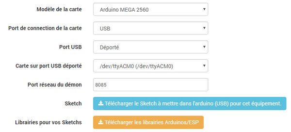

   > Pour les modèles WiFi (ESP8266), il est spécifiquement généré, en tenant compte du port, du SSID, et du mot de passe wifi, l'adresse IP étant renvoyée par la carte.  
   > _Ainsi que de l'IP, du complément '/jeedom' (ou non) et du port du Jeedom ( d'après votre configuration réseau dans Jeedom)._  
   > _NB. Il faut tout de même renseigner l'adressse IP la premiére fois._

   > Les _SSID_ et _mot de passe_ ne doivent pas contenir d'espaces !

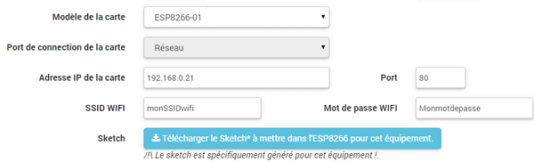

Configuration des pins
---

* **Modal Paramétrages / affectation des pins**

   Permet de sélectionner les pins voulues et de leur affecter une fonction de type entrée (info) ou sortie (action).   
   **_NB : Des compléments d'informations sont disponibles dans la FAQ._**

   * Entrées: Analogiques, Digitales, Compteur d'impulsions
   * Sorties: Low (=0=Gnd), High (=1=Vcc), Switch (inverse la sortie), Pulse (mettre la sortie à low ou high pendant une durée limitée - ex.:actionner momentanément, via un relais, un télérupteur, une électrovanne, un volet, un contact sec, etc..).

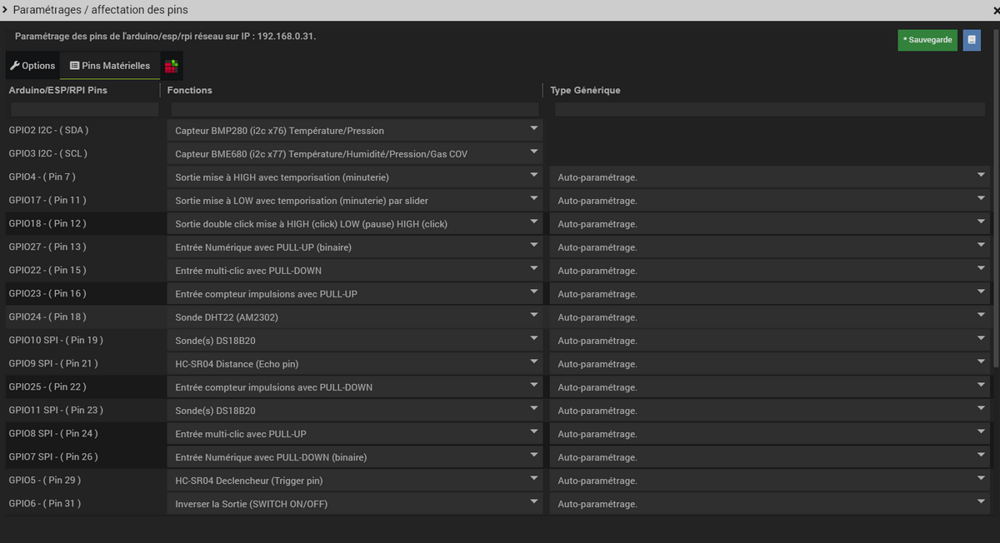

   > **_Les Pins seront configurables uniquement après une première sauvegarde de votre équipement._**  
   > Une fois celles-ci configurées et sauvées (dans la fenêtre de modale), une sauvegarde de l'équipement générera toutes les commandes nécéssaires.

   > Il n'est pas utile de donner une fonction à chaque pin, mais uniquement à celles dont vous avez besoin.
   > Cela évitera la génération de commandes inutiles et de trop charger Jeedom.

   > Il est désormais possible de configurer les generic type directement, et d'affecter les pins à des groupes (équipements) virtuels, voir la FAQ.

* **Modal Paramétrages / affectation des pins utilisateur**

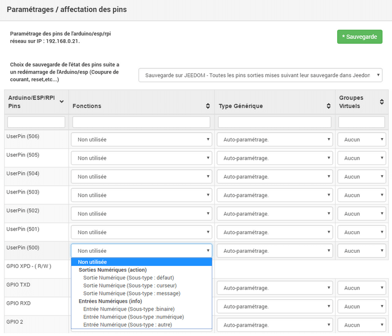

* Onglet **Pins / GPIO**

   Permet d'ajouter un certain nombre de pins utilisateur pour vos sketch Arduinos/ESPs : _0 à 100 max_

   Il est possible d'activer ou non la génération automatique des commandes ALL_

   * ALL_LOW	Met toutes les pins output à LOW
   * ALL_HIGH	Met toutes les pins output à HIGH
   * ALL_SWITCH	Inverse toutes les pins output
   * ALL_PULSE_LOW	Met toutes les pins output à LOW pendant le temps choisi
   * ALL_PULSE_HIGH	Met toutes les pins output à HIGH pendant le temps choisi

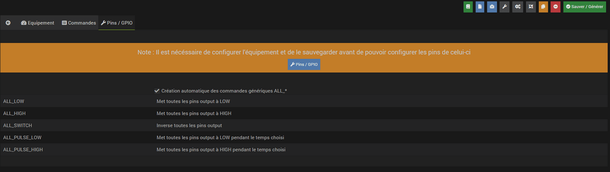

Commandes
---

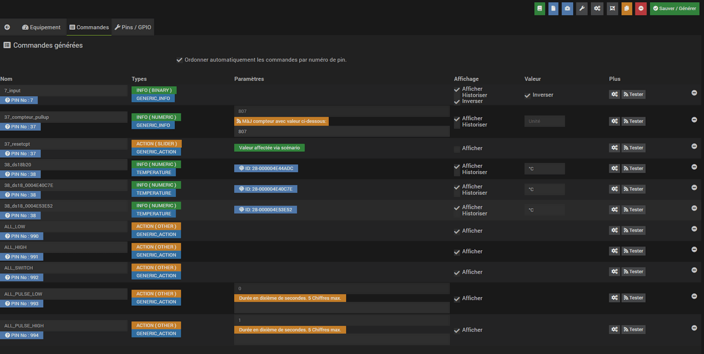
* **Sauvegarde de l'équipement** :  
   Les commandes sont générées automatiquement, le démon est démarré si nécéssaire, la configuration des pins est envoyée à la carte ( Arduino, RPI, PiFace ) ainsi que quelques autres paramêtres.  
   Ainsi, la roue crantée tournante peut rester affichée un bon moment. Il ne faut donc pas s'en inquièter.

* Les commandes sont créées automatiquement lors de la sauvegarde de l'équipement.

* Il est bien sûr possible de renommer les commandes.

   > Pour chaque commande de type 'action', une commande de type 'info' de retour d'état est aussi créée _(si utile)_.

* Les boutons _Afficher_ et _Historiser_ sont les boutons habituels d'affichage (ou non) de la commande sur le widget et de son historisation (ou non).

* Le bouton _Inverser (colonne Affichage)_ permet d'inverser le résultat d'une commande info (sous-type binaire) sur le dashboard par ex.

* Le bouton _Inverser (colonne Valeur)_ permet d'inverser le résultat d'une commande info (sous-type binaire) avant de la fournir à Jeedom.

* Le bouton _Tester_ permet de...tester une commande action par ex.

Il n'est pour l'instant pas prévu de pouvoir ajouter des commandes manuellement.

> Pour les commandes info de type 'compteur', elles sont remises a la valeur stockée dans l'équipement à chaque sauvegarde de celui-ci.  
> A l'inverse, après un reboot de l'arduino (par ex.), la derniére valeur est recupérée auprès du Jeedom.  
> Si une erreur de communication survient a ce moment la, le compteur sera réinitialisé à zéro.   
> Sur Arduino/ESP / NodeMCU / Wemos, il est possible de les ré-initialiser à une valeur spécifique, une option "reset" est présente sur la commande de l'équipement concerné.

Widgets
---

Ce sont ceux par défaut de Jeedom.

Les widgets desktop ressemblent à cela :

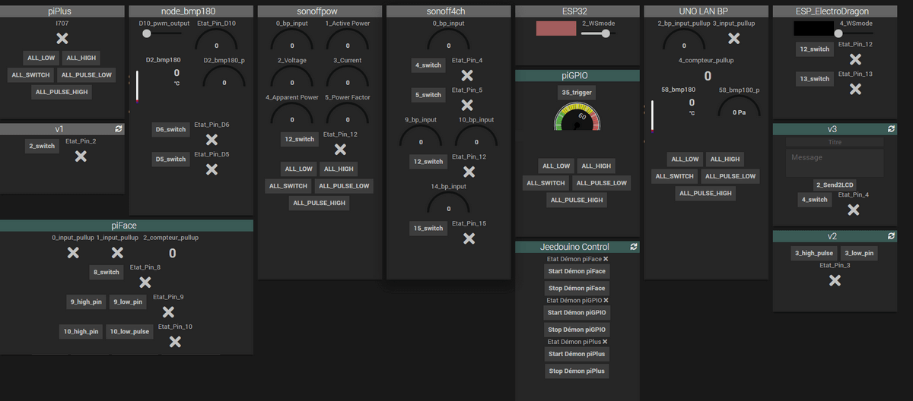

Page santé dans Jeedom
======================

Etat des démons du plugin
---

Le plugin indique Ok si tous les démons et dépendances sont fonctionnels.  
Il est possible d'ouvrir la page de configuration du plugin directement en cliquant sur Jeedouino.

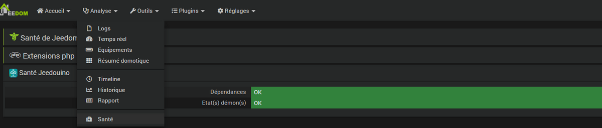

Il est possible de voir les états des équipements directement en cliquant sur l'icone à droite de Jeedouino.

Etats des équipements du plugin
---

La liste donne tous les équipements avec leurs ID, IP, Ports, Modèles et dates de communication.  
Il est possible de cliquer sur le nom de l'équipement pour aller sur sa page.

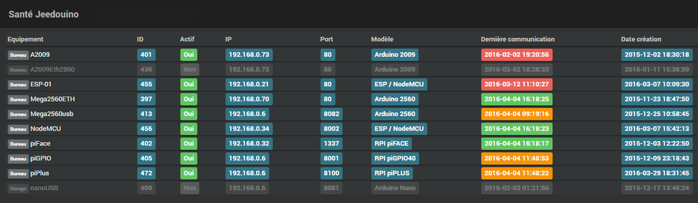

Les dates de dernières communications sont colorisées:

* Vertes si moins de 2h
* Orangées si moins de 24h
* Rouges au-delà de 24h.

> N.B. Un équipement grisé est un équipement désactivé.

FAQ
===

Les démons  ne démarrent pas ?
---

Dans la majorité des cas, cela provient d'une absence ou d'une mauvaise installation des dépendances.
Que ce soit pour une première installation du plugin, une mise à jour de celui-ci, ou la restauration d'un backup Jeedom, il faut (ré)installer les dépendances générales.

   >Dans tous les cas, l'erreur est certainement indiquée dans les logs - il suffit de les consulter pour aviser.

Sketchs Personnels/Modifiables et Commandes Utilisateur
---

- **Entêtes  des sketchs**  
   Avec les nouvelles fonctionnalités, les sketchs peuvent devenir trop lourd pour les "petits" Arduinos.
   Il est donc possible de désactiver certaines de ces fonctionnalités afin d'alléger les sketchs si besoin.
   Vous trouverez en entête des sketchs cette possibilité :

   >**#define DEBUGtoSERIAL 0**	// 0, ou 1 pour debug dans la console serie  
   >**#define UseWatchdog 0**  
   >**#define UseDHT 1**  
   >**#define UseDS18x20 1**  
   >**#define UseTeleInfo 0**  
   >**#define UseLCD16x2 0**	// 0 # None (Aucun) / 1 # LCD Standard 6 pins / 2 # LCD via I2C  
   >**#define UseHCSR04 0**  
   >**#define UseBMP180 0**		// pour BMP085/180 Barometric Pressure & Temp Sensor  
   >**#define UseServo 0**  
   >**#define UseWS2811 0**		// Pour gerer les led stips a base de WS2811/2 avec l'excellente lib Adafruit_NeoPixel  

   >**#define UserSketch 0**		// _Vous permet d'inclure du sketch perso_  
   >_Tags pour rechercher (CTRL F) l'emplacement pour votre code :_  
   >_UserVars_  
   >_UserSetup_  
   >_UserLoop_  

   Pour les sketchs ESP, il est en outre possible de laisser le système récupérer une adresse IP libre (DHCP)
   ou de la forcer si besoin.

   >**#define NODHCP 0**					// 0 pour IP via DHCP, 1 pour IP fixée dans le sketch.

- **Sketchs et pins Utilisateur**  
Pour vos Sketchs perso, il suffit d'aller voir dans les sketchs, tout est indiqué dedans avec des exemples.
   >Pensez à activer l'option dans la page de configuration du plugin, et à selectionner le nombre de pins désirées sous l'onglet Pins/GPIO de votre équipement.
   >Elles apparaîtrons dans l'onglet Pins Utilisateur (à coté de celui des Pins Matérielles) dans la fenêtre de modale.

   Pour les commandes liées coté Jeedom, il suffit de les configurer comme pour les pins matérielles.

   * Vous aurez le choix entre 3 types de pins entrées et 3 types de pins sorties :
      * Entrée Numérique (Sous-type : binaire)
      * Entrée Numérique (Sous-type : numérique)
      * Entrée Numérique (Sous-type : autre)
      * Sortie Numérique (Sous-type : défaut)
      * Sortie Numérique (Sous-type : curseur)
      * Sortie Numérique (Sous-type : message)

Generic Types & App mobile
---
Les generic types sont un ajout de Jeedom pour le fonctionnement du plugin mobile et de l'app mobile liée.  
Pour plus d'informations les concernant, veuillez-vous reportez à leurs documentations respectives.

Si vous avez des équipements Jeedouino pour lesquels vous aviez déja configuré des generic types (en configuration avancée), lors de la mise à jour, le plugin essaiera de les récupérer.  
Vous pouvez aussi utiliser le mode auto, dans lequel le plugin essaiera de trouver le generic type le plus adapté.  
Sinon vous pouvez choisir le generic type dans le plugin, et lors de la création des commandes le plugin s'adaptera si possible.

>Par exemple, si vous choisissez une pin en _Sortie mise à LOW (HIGH générée aussi)_ et le generic type _LIGHT ON_ , alors le plugin générera les commandes (et vice-versa):  
>Sortie mise à LOW avec _LIGHT ON_  
>Sortie mise à HIGH avec _LIGHT OFF_  
>Etat de la sortie avec _LIGHT STATE_  

>Si sur **un même équipement** vous avez beaucoup de commandes ainsi que beaucoup de generic type différents ( par ex. LIGHT, ENERGY, FLAP, SIREN, etc..) il est possible que l'app mobile ne vous les affichent pas tous, ou génére une erreur.  
>Cela évoluera certainement avec les futures versions de celle-ci.  
>_L'utilisation de **Groupes Virtuels** pour scinder les équipements est alors conseillée._   

Groupes Virtuels
---

> **Pré-requis : avoir le plugin Virtuel installé et activé.**

Pour activer les groupes virtuels, une option est présente sur la page de configuration du plugin.

Il faut ensuite créer les équipements virtuels dont vous aurez besoin (avec le plugin Virtuel bien-sûr).

Par la suite, lors de la configuration des pins dans vos équipements Jeedouino, il suffira d'indiquer pour chaque pin dans quel Virtuel, elle doit  être dupliquée.

>**Un exemple pour bien comprendre :**  
>Mettons que vous avez dans votre jardin en deux endroits :   
>Un NoneMCU avec une carte 8 relais qui commande 4 electrovannes, 2 éclairages et une pompe de bassin.  
>Un Raspberry avec une carte 4 relais qui commande 2 electrovannes, 1 éclairage.  
>  
>_Vous avez donc 2 équipements séparés mais avec des fonctionalitées similaires que vous aimeriez regrouper par fonction._  
>Les virtuels de Jeedom sont là pour ça, mais il vous faut copier les commandes _manuellement_.  
>Les groupes virtuels de Jeedouino vous permettent de les sélectionner d'un clic, et de laisser faire le plugin automatiquement.
>Dans cet exemple vous n'avez qu'à créer les virtuels : _Arrosage, Eclairage, Bassin._  
>Puis pour chaque pin de chaque équipement Jeedouino vous affectez le bon virtuel, et vous sauvez.  
>_Il ne vous reste plus qu'à utiliser vos virtuels._

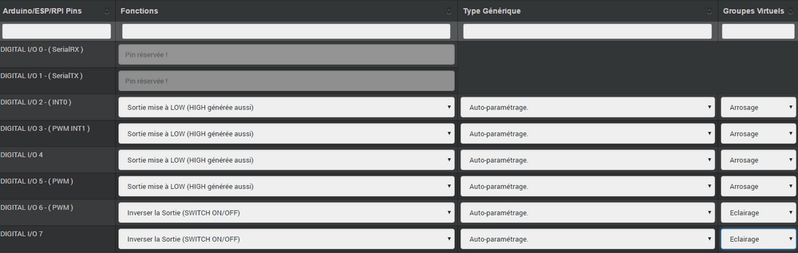

Les équipements avec démons ( piGPIO, piFace, piPlus/MCP23017, ArduinoUSB ) ont changés de port de connection tout seuls.
---
Cela est possible et normal.  
En effet, lors du démarrage, un démon essaye d'utiliser le port choisi a 2 reprises avec un délai d'attente d'environ 11s.  
Si au bout de ces 2 tentatives le port n'est toujours pas disponible, alors il essaie d'en trouver un de libre automatiquement.  
Et s'il en trouve un, il l'utilise et met à jour l'équipement idoine.

Les équipements avec démons ( piGPIO, piFace, piPlus/MCP23017, ArduinoUSB ) ne sont pas directement fonctionnels après un reboot.
---
Voir ci-dessous.

Les démons  ne démarrent pas aprés un reboot ?
---
Les démons ne sont relancés **qu'environ 4 minutes** après le lancement de Jeedom.  
Cela permet d'essayer d'assurer une compatibilité avec les systèmes un peu plus lents (Ex: RPI 1, Systèmes chargés, etc...).

> Une option **AutoReStart** permettant le redémarrage automatique des démons est présente sur la page de configuration du plugin (onglet Démons).

Le plugin est-il compatible Docker ?
---
A la base, non à cause de la configuration spécifique du Jeedom sous docker.

Cependant une option, dans la page de configuration du plugin a été ajoutée pour pallier à cela.  
Il faut l'activer, et renseigner l'IP de l'hôte (Celle du NAS le plus souvent) et le port mappé (souvent 9080).

Dans la configuration réseau de Jeedom, il faut désactiver la gestion du réseau par Jeedom  
( Normalement c'est déja la cas, si votre installation docker fonctionne correctement).

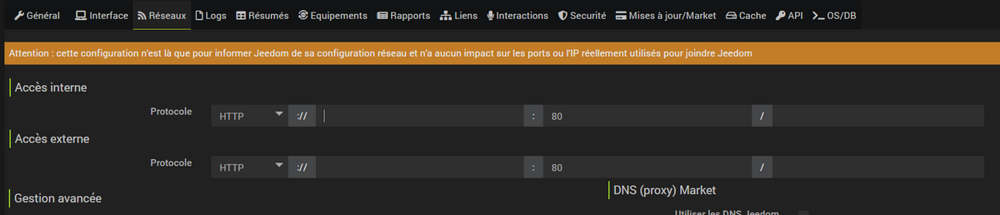

Que signifient LOW ou HIGH ?
---
* Pour faire simple Low = 0 = Gnd, c'est donc la mise à l'état bas de la pin.  
* Pour faire simple High = 1 = Vcc , c'est donc la mise à l'état haut de la pin.

Que signifient Pull_Up ou Pull_Down ?
---
* Pour faire simple Pull_Up signifie qu'il y a une résistance (interne de tirage) entre la pin concernée et le Vcc du Microcontrôleur.  
Cela permet de maintenir la pin à l'etat haut (=High=1=Vcc) et d'éviter des tensions parasites.  
_Ce mode est souvent disponible, dans le cas contraire, il vous suffit de mettre vous même une résistance dans votre montage._  
* Pour faire simple Pull_Down signifie qu'il y a une résistance (interne de tirage) entre la pin concernée et le Gnd du Microcontrôleur.  
Cela permet de maintenir la pin à l'etat bas (=Low=0=Gnd) et d'éviter des tensions parasites.  
_Ce mode n'est pas souvent disponible, et dans ce cas, il vous suffit de mettre vous même une résistance dans votre montage._

Configuration détaillée des pins
================================

Configuration des pins
---
Permet de sélectionner les pins voulues et de leur affecter une fonction de type entrée (info) ou sortie (action).

>**Toutes les fonctions des pins ne sont pas forcément disponibles sur toutes les cartes / microcontrôleurs, chacun ayant ses propres caractéristiques.**

>**Rappel** : Il n'est pas utile de donner une fonction à chaque pin, mais uniquement à celles dont vous avez besoin.  
> Cela évitera la génération de commandes inutiles et de trop charger Jeedom.

Pins Entrées (Input)
---
   + **Analogiques**  
   Permet de brancher un capteur analogique.
   Exemples:
      * Capteur de distance IR
      * Capteur d’intensité sonore
      * Capteur de lumière ambiante
      * Capteur rotatif analogique
      * Etc..

   + **Numériques**  
   Permet de brancher un capteur numérique (qui renvoie un binaire 0 / 1 i.e low / high).

      >En pull_up, l'état de l'entrée au repos est HIGH (=1), il faut la mettre à LOW (=0) pour déclencher un signal.  
      >En pull_down, l'état de l'entrée au repos est LOW (=0), il faut la mettre à HIGH (=1) pour déclencher un signal.

   + **Détails**

      + **Compteur d'impulsions** (Compteur d'Eau , Electricité, Gaz, Portes, Fenêtres, Barrières IR, ... )
	  >
      >Il est possible d'initialiser le compteur a une valeur donnée.
      >Le bouton Reset sert a l'envoyer à la carte.

      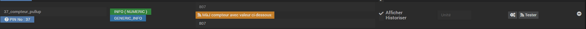

      + **Entrée Numérique avec PULL-DOWN** (binaire)
      + **Entrée Numérique avec PULL-UP** (binaire) (Bouton poussoir, interrupteur, capteur d'ouverture, capteur de mouvement.. )
      + **BMP 085/180** Capteur Température et pression (pins SDA / SCL)
      + **BMP 280** Capteur Température et pression (pins SDA / SCL)
      + **BME 280** Capteur Température, humidité et pression (pins SDA / SCL)
      + **BME 680** Capteur Température, humidité, gas cov et pression (pins SDA / SCL)
      + **HC-SR04 Echo** En lien avec la pin Trigger, permet de récupérer la distance mesurée par le capteur ultrason.
          > Pensez à l'activer dans l'entête du sketch : #define UseHCSR04 1

      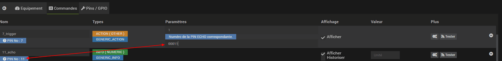

      **_Uniquement sur Arduino / ESP / NodeMCU / Wemos :_**
      + **Sonde DHT 11, 21, 22** - Permet d'avoir 2 commandes, une pour la température, et une pour l'humidité.
      + **Entrée téléinfo ERDF ( pin RX )** - Permet d'avoir une commande de réception de message série pour la téléinfo.

      >Si vous avez le plugin Téléinfo d'installé et d'activé, cela crééra automatiquement un équipement téléinfo avec la trame reçue (il faudra activer les commandes auto dans cet équipement).  

      >**Dans ce cas d'utilisation, si le démon Téléinfo reste sur NOK, c'est normal, il n'est pas utilisé.**

      >Cette entrée n'est pas disponible sur R.Pi gpio car elle est déja gérée en direct par le plugin Téléinfo.

      **_Uniquement sur Raspberry PI GPIO :_**
      + **Sonde DHT 11, 22 (AM2302)** - Permet d'avoir 2 commandes, une pour la température, et une pour l'humidité.

      **_Uniquement sur Arduino / ESP / NodeMCU / Wemos et Raspberry PI GPIO :_**
      + **Sonde(s) DS18B20** - Permet d'avoir une/des commande(s) avec la température.
      >Une seule commande (par pin) est créée à la sauvegarde.  
      En cas de plusieurs ds18b20 (sur la même pin), les commandes suivantes seront générées au fur et a mesure des remontées de température.  
      Le délai de remontée par défaut est de 5 minutes.  
      Il est paramétrable dans l'onglet **Options** du menu **Pins/GPIO**.

      + **Entrée compteur impulsions avec PULL-UP**
      + **Entrée compteur impulsions avec PULL-DOWN**

      >Permet de compter des impulsions détectées successivement.  
      >Il est possible de régler le délai anti-rebonds à votre convenance.

      + **Entrée multi-clics avec PULL-DOWN**
      + **Entrée multi-clics avec PULL-UP**

      >Permet d'avoir une commande dont la valeur est le nombre d'appuis détectés successivement sous un délai d'environ 1 seconde.  
      >Pour un appui long ( >1s ) la valeur sera de 99.

      >*Sur piGpio, le fonctionnement multitâche du système ne permet pas une fiabilité à 100% de la détection des appuis.*  
      >J'essaierai d'améliorer ce point-là mais sans garantie. Pour tests uniquements.

Pins Sorties (output)
---
   + **Génériques**  
      **_Uniquement sur Arduino / ESP826x:_**  
      + **Envoi valeur au servo par slider** - permet de commander un servo avec une valeur entre 0 et 180 par ex.  
      + **Commande pour RGB LED Strip a base de WS2811** - Permet d'envoyer une valeur de couleur, ou de sélectionner parmi 17 effets.  

      >**Attention un effet est bloquant**, il vaux mieux dédier un arduino/esp pour l'instant.  
      >Limité à un ruban led (strip) par arduino/esp pour l'instant.

      + **Envoi d'un message sur LCD16x2** - Permet d'envoyer un titre message (16 caractères chaque) sur un écran LCD 16x2. Standard / I2C

      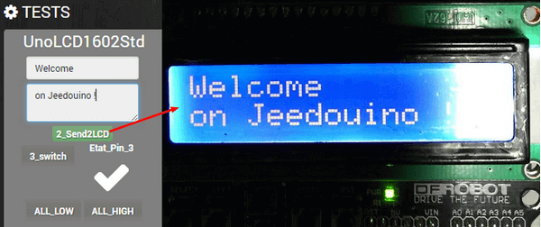

   + **Numériques**  
   Permet d'actionner un récepteur numérique ( relais, led, etc ... )

      + **Inverser la sortie (Switch)**.  Permet de mettre la sortie a LOW (=0) si elle est a HIGH (=1), et vice-versa. SANS connaître l'état précédent.
         Pratique pour changer l'état d'une led (clignotement).  
         Actionner un relais comme un interrupteur (un coup, j'allume, un coup j'éteints.)  
      + **Sortie mise à LOW (HIGH générée aussi)**.  Permet d'avoir 2 commandes pour mettre la sortie a LOW (=0) ou a HIGH (=1).
         Pratique pour forcer l'état d'une sortie dans un scénario par ex.  
      + **Sortie mise à LOW/HIGH avec temporisation (minuterie)**.  Permet de mettre la sortie a LOW (=0) ou a HIGH (=1) pendant une durée limitée.  
	  + **Sortie mise à LOW/HIGH avec temporisation (minuterie) avec slider**.  idem que précédent, avec variable tempo paramétrable, utilisable dans un scénario par ex.

      >Durée exprimée en dixième de secondes et 5 chiffres max. Soit de 0.1s a 9999.9s (env 166 minutes).  
      >*Une commande opposée (sans temporisation) est aussi créée afin de pouvoir stopper (plus tôt) la commande temporisée pré-citée (Stop Volets par ex.).*
	  >  
      >Pratique pour actionner une lumiere x minutes/secondes.  
      >Actionner un relais moins d'une seconde pour commander un contact sec / télérupteur (ex: 00007 pour 0,7s).  
      >Actionner un relais d'une élèctrovanne pour commander l'arrosage du jardin pendant un durée déterminée (ex: 06000 pour 10min).  
      >Actionner des relais pour l'ouverture/fermeture de volets roulants (ex: 00400 pour 40s).

      + **Sortie double clic mise à HIGH (clic) LOW (pause) HIGH (clic)**.  Permet de simuler un double clic (pour une télécommande de volets par ex).
         La durée du clic/pause/clic est modifiable.
         Attention à ne pas choisir des durées trop longues car cela est bloquant.

      >Durée exprimée en dixième de secondes et 3 + 3 chiffres max. Soit de 00.1s a 99.9s.
      >Les 3 premiers concernent la durée du clic.
      >Les 3 suivants, la durée de la pause.

      + **HC-SR04 Trigger** En lien avec la pin Echo, permet de lancer la mesure de la distance par le capteur ultrason. Cf pin Echo.

   + **Numériques/pseudo-Analogiques**  
      + **Sortie PWM**, Permet de régler l'intensité d'un ruban led compatible par ex.

Changelog
=========
Lien vers le [Changelog](changelog.md)
